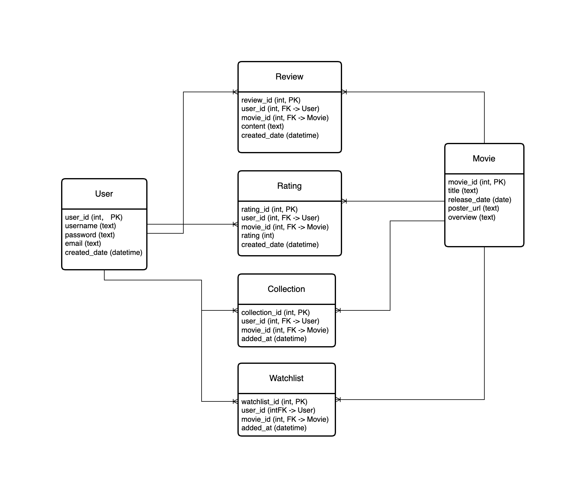

# Database Design

## Conceptual Model
- **Entities**:
    - **User**: Represent a registered user.
    - **Movie**: Represent a movie from API.
    - **Review**: User comments on movies.
    - **Rating**: User rates movies.
    - **Collection**: Movies collected by users.
    - **Watchlist**: Movies added to watchlist by users.
- **Relations**:
    - User writes Review about Movies (1:N, N:1).
    - User gives Ratings to Movies (1:N, N:1).
    - User owns Collection containing Movies (1:N, N:1).
    - User has Watchlist containing Movies (1:N, N:1).

## Logical Model
### User
- 'user_id' (PK): Unique identifier.
- 'username': Display name.
- 'password': Encrypted password.
- 'email': Unique email for login.
- 'created_at': Registration time.

### Movie
- 'movie_id' (PK): Unique identifier.
- 'title': Title of the movie.
- 'release_date': Release date.
- 'poster_url': URL of the movie poster.
- 'overview': Brief summary of the movie.

### Review
- 'review_id' (PK): Unique identifier.
- 'user_id' (FK): User who wrote the review.
- 'movie_id' (FK): Movie that was reviewed.
- 'content': Comment text.
- 'created_at': Comment time.

### Rating
- 'rating_id' (PK): Unique identifier.
- 'user_id' (FK): User who rated the movie.
- 'movie_id' (FK): Movie that was rated.
- 'rating': Rating score.
- 'created_at': Rating time.

### Collection
- 'collection_id' (PK): Unique identifier.
- 'user_id' (FK): User who owns the collection.
- 'movie_id' (FK): Movie that is in the collection.
- 'added_at': Collection time.

### Watchlist
- 'watchlist_id' (PK): Unique identifier.
- 'user_id' (FK): User who owns the watchlist.
- 'movie_id' (FK): Movie that is in the watchlist.
- 'added_at': Time when the movie was added to the watchlist.   

## ER Diagram

